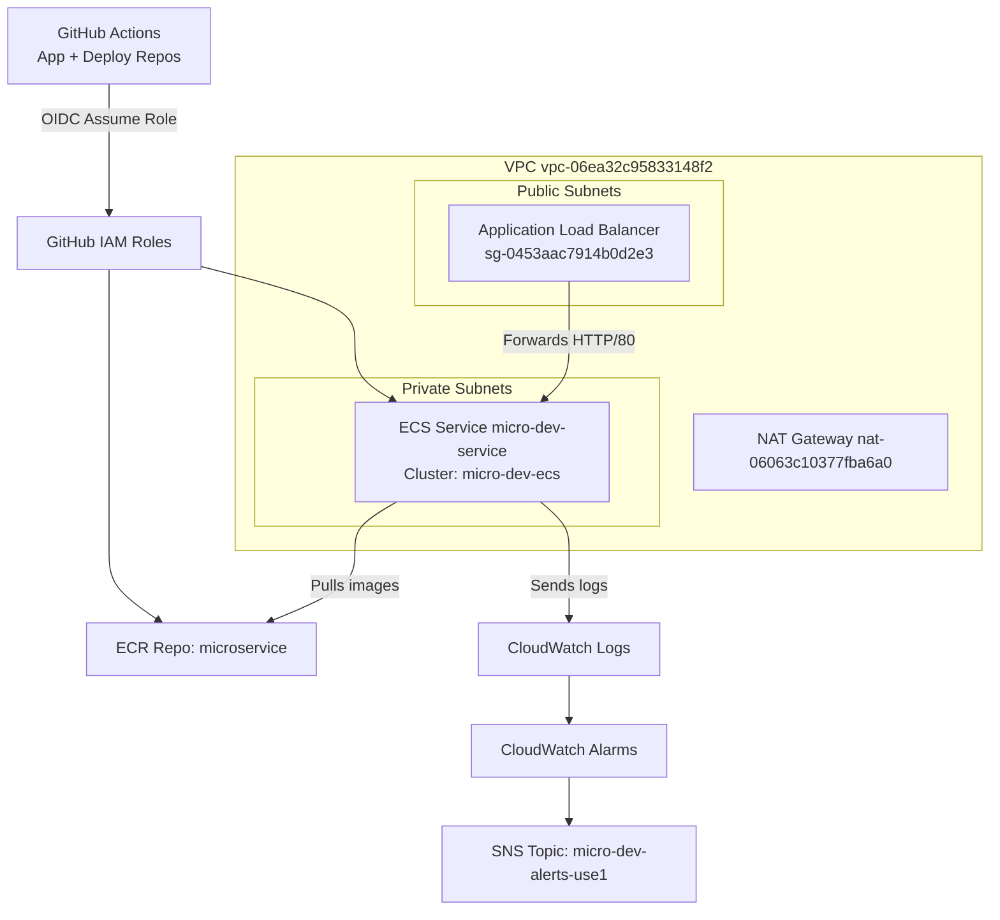
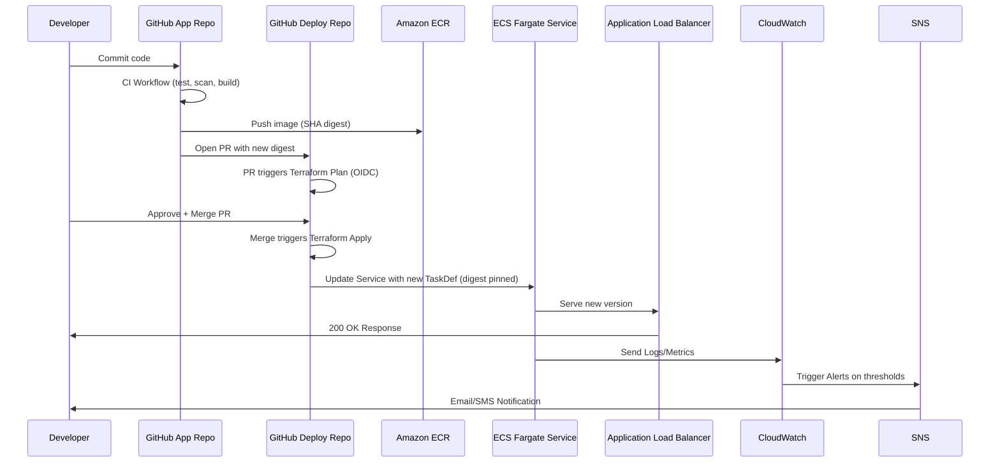

# ecs-microservice-deploy

# Project README (Deploy Repo)

> **Scope:** ECS Fargate microservice with ALB, GitHub Actions (OIDC), Terraform IaC, autoscaling, and CloudWatch/SNS alerting.

## 1) Overview

* **Objective:** Deploy a containerized microservice on AWS ECS Fargate using Terraform and GitHub Actions, with GitOps approvals.
* **Outcome (Day-1 → Day-8):** VPC + subnets + NAT, ALB + target group, ECS cluster/service, CI pipelines (app build → ECR; deploy plan/apply), autoscaling policies, CloudWatch alarms wired to SNS, alarms validated.

## 2) Architecture (high level)

* **Network:** VPC `vpc-06ea32c95833148f2` (us-east-2), 2× public subnets (ALB), 2× private subnets (ECS tasks) + NAT for egress.
* **Compute:** ECS Fargate service `micro-dev-service` on cluster `micro-dev-ecs`.
* **Ingress:** ALB `sg-0453aac7914b0d2e3` listener → Target Group `micro-dev-tg-80` on port 80 → container `micro-dev-app` (port 80); health check path `/`.
* **Images:** Amazon ECR repository `microservice` (images pinned by **digest**).
* **CI/CD:**

  * **App repo:** Build → scan → push to ECR → output digest → PR to deploy repo.
  * **Deploy repo:** PR = `terraform plan` (OIDC); merge to `main` = `terraform apply`.
* **Observability:** CloudWatch Logs (per task); CloudWatch Alarms → SNS notifications.
* **Autoscaling:** Application Auto Scaling target tracking (min=1, max=3) on service CPU/Memory.

### 📐 System Architecture Diagram (Mermaid)



### 🔄 CI/CD Flow Diagram (Mermaid)



## 3) Repositories & Layout

**App repo** (`ecs-microservice-app`)

```
app/
Dockerfile
.dockerignore
.github/workflows/ci.yml
```

**Deploy repo** (`ecs-microservice-deploy`)

```
infra/terraform/
  providers.tf  backend.tf  main.tf  variables.tf  outputs.tf
  networking/   iam/        ecr/     ecs/          observability/
  ecs/autoscaling.tf
  observability/alarms.tf
environments/dev/dev.tfvars
.github/workflows/plan_apply.yml
```

## 4) Prerequisites

* AWS account (region **us-east-2**), GitHub repos (App + Deploy)
* **OIDC roles:** `GitHubECRPushRole`, `GitHubTerraformDeployRole`
* **Terraform backend:** S3 (versioned, encrypted) + DynamoDB table `tf-locks`
* Local tools (optional): Terraform ≥ 1.6, AWS CLI v2, Docker

## 5) Configuration

Update `environments/dev/dev.tfvars` with your live values:

```hcl
region         = "us-east-2"
project_prefix = "micro"
env            = "dev"
# Networking
vpc_id                        = "vpc-06ea32c95833148f2"
alb_public_subnet_ids         = ["subnet-03c932e9f9306ea34", "subnet-048636854206d63b92"]
ecs_private_subnet_ids        = ["subnet-0cb937fb5a2ff2457", "subnet-06c96b155527807d1"]
alb_security_group_id         = "sg-0453aac7914b0d2e3"
# ECS/ALB identifiers
cluster_name                  = "micro-dev-ecs"
service_name                  = "micro-dev-service"
tg_arn_suffix                 = "targetgroup/micro-dev-tg-80/<hash>"
alb_arn_suffix                = "app/micro-dev-alb/<hash>"
# Observability
sns_topic_arn                 = "arn:aws:sns:us-east-2:803767876973:micro-dev-alerts-use1"
```

## 6) Deploy Steps (Dev)

**One-time:**

1. Create TF backend (S3 + DynamoDB) and set `backend.tf` accordingly.
2. Create OIDC roles and attach least-privilege policies; add role ARNs to GitHub Secrets.
3. Create ECR repo `microservice` (scan-on-push + KMS).

**Day-to-day (GitOps):**

1. **App change → build:**

   * Commit to App repo → GitHub Actions builds, scans, pushes to ECR.
   * The workflow outputs the **image digest** and PR to Deploy repo.
2. **Deploy approval:**

   * Merge the Deploy repo PR → `plan_apply` workflow runs with `GitHubTerraformDeployRole` and applies.
   * ECS service updates to the new image **digest**.
3. **Verify:**

   * Check ALB DNS → should return `200 OK`.
   * Confirm task logs in CloudWatch and alarms remain `OK`.

## 7) Rollback Procedure (Quick)

If a bad deploy occurs:

1. In Deploy repo, revert the image digest to the **previous known good** value (use Git history).
2. Commit & PR → `plan` → merge to `main` → `apply` updates the ECS service back to prior digest.
3. Watch ECS events until task is stable and Target Group is `healthy`.

> **Alternative:** Temporarily scale desired count to 0 then back to 1 to force a clean replacement, if needed.

## 8) Autoscaling (Summary)

* Target tracking for `micro-dev-service` (min=1, max=3) using CPU and/or Memory.
* Policies provisioned in `ecs/autoscaling.tf`. Deploy role includes `application-autoscaling:*` and ECS `UpdateService`.

## 9) Monitoring & Alerts

CloudWatch alarms (see `observability/alarms.tf`):

* **ALB 5xx high**
* **Target Group unhealthy hosts**
* **ECS CPU high**
* **ECS Memory high**
* **ECS Running tasks low**

All alarms publish to `arn:aws:sns:us-east-2:803767876973:micro-dev-alerts-use1`. Validated with test notifications.

## 10) Troubleshooting (Quick Reference)

* **ALB 503 / Unhealthy TG:** Verify container port = target group port; health path `/`; ECS SG allows from ALB SG; task running. Check container logs.
* **Tasks can’t pull image (ResourceInitializationError):** Private subnets must have 0.0.0.0/0 → NAT Gateway `nat-06063c10377fba6a0`; Task Execution Role needs ECR + logs permissions.
* **OIDC AccessDenied:** `sub` in trust policy must exactly match `repo:OWNER/REPO:ref:refs/heads/BRANCH`.
* **Terraform backend errors:** Bucket name/region mismatch or missing DynamoDB table `tf-locks`.
* **PassRole errors:** Ensure Deploy role has `iam:PassRole` only for the **task execution role ARN**.

## 11) Cost Guardrails

* Monthly AWS Budget ($50) publishes to the SNS topic.
* Tag resources: `owner=Parris`, `project=ecs-micro`, `env=dev`.

## 12) Security Notes

* Never store static AWS keys in repos; use GitHub OIDC roles.
* Pin images by **digest**; avoid mutable `:latest`.
* Least privilege IAM: tighten to ARNs as resources stabilize.

---

# Operations Runbook (Deploy Repo)

## A) Contacts & Ownership

* **Primary owner:** Parris Brantley
* **On-call notifications:** SNS → Email/SMS list

## B) Production Inventory

* **Region:** us-east-2
* **Cluster/Service:** `micro-dev-ecs` / `micro-dev-service`
* **ECR repo:** `microservice`
* **ALB DNS:** <copy from console>
* **SNS Topic ARN:** `arn:aws:sns:us-east-2:803767876973:micro-dev-alerts-use1`
* **VPC ID:** `vpc-06ea32c95833148f2`
* **Subnets:** public [ `subnet-03c932e9f9306ea34`, `subnet-048636854206d63b92` ], private [ `subnet-0cb937fb5a2ff2457`, `subnet-06c96b155527807d1` ]
* **NAT Gateway:** `nat-06063c10377fba6a0`
* **ALB SG:** `sg-0453aac7914b0d2e3`

## C) Alarms — What They Mean & What To Do

1. **ALB 5xx High** → Upstream container errors → Check ECS logs, app health endpoint.
2. **Target Group Unhealthy Hosts** → Health checks failing → Confirm path `/`, SG rules, task running.
3. **ECS CPU/Memory High** → Service saturated → Confirm autoscaling; consider raising max capacity.
4. **ECS Running Tasks Low** → Tasks crashed → Inspect last stopped reason, image pull, env vars; redeploy.

## D) SOPs

* **Deploy:** Merge approved PR → Terraform apply → ECS update.
* **Rollback:** Revert image digest → PR → apply.
* **Scale override (temporary):** Adjust `desired_count` (Terraform) or ECS console, then restore IaC.
* **Rotate secrets:** Update in AWS SSM/Secrets Manager → restart tasks.

## E) Common Break/Fix

* **NAT/ECR Pull:** Ensure route table default → NAT GW; NACL allows egress.
* **OIDC Role Fail:** Validate trust `aud` + `sub`; branch match; re-run.
* **ALB Path Mismatch:** Health check must be `/`; update module and apply.

## F) Verification Checklists

* **Post-Deploy:** ALB returns 200, TG healthy, new task def active, logs clean.
* **Post-Rollback:** Same checks; alarms back to OK.

## G) Appendices

* IDs and ARNs listed above; GitHub repos; CloudWatch dashboards.

---

> **Next (Mini-Step 9.3):** End-to-End validation — make an app change, push, and confirm CI/CD updates ECS + ALB with new version.
